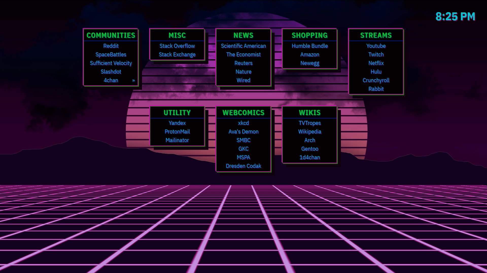

Startpage
============================================================================
A simple startpage. See a live version [here](https://fungiofdeath.github.io/startpage-dm01/).



## Installation
Clone this repo via
```
git clone https://github.com/FungiOfDeath/startpage-dm01.git
```

### Setting This as your New Tab Page

#### Chrome
I don't know how to do this for chrome so don't ask me.

#### Firefox
See [this](https://support.mozilla.org/en-US/questions/1210576) support article.

tl;dr:
 - Copy [ff/local-settings.js](ff/local-settings.js) to `%PROGRAM_FILES%/mozilla firefox/defaults/prefs/`.
 - In [ff/firefox.cfg](ff/firefox.cfg), set `newTabURL` to point to [index.html](index.html).
 - Copy [ff/firefox.cfg](ff/firefox.cfg) to `%PROGRAM_FILES%/mozilla firefox/`.

## Editing
To change which sites are shown, edit [sites.json](sites.json).

**Note**: All sites must have a `"subsites": [ ... ]` tag. If any site is missing this tag then it (and everything after it) will not be loaded. As-is, this site cannot handle multiple levels of subsites -- i.e. if a subsite has a subsite then things will break -- so don't do that.

## License
This project is licensed under the [Unlicense](LICENSE).
